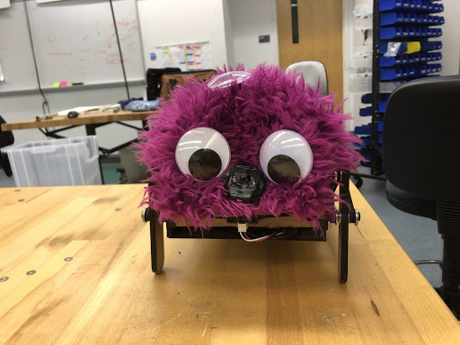

Every semester, students pass through the halls of the Olin College of Engineering Academic Center sad, alone, and reminding themselves that the weekend is only a few days away. We wondered why people looked so stressed, and sometimes even sad while in this stately building and came to the conclusion that it was because there was a genuine lack of small furry robots that say hi to people.

There are 75 days in a semester, and almost everyone can say that there have been 0 times when a cute robot has said hi to you. Unbelievable!

This is why we created The Wanderer: a cute, personable robot that will wander around the Academic Center and greet anyone it sees to brighten their day!

