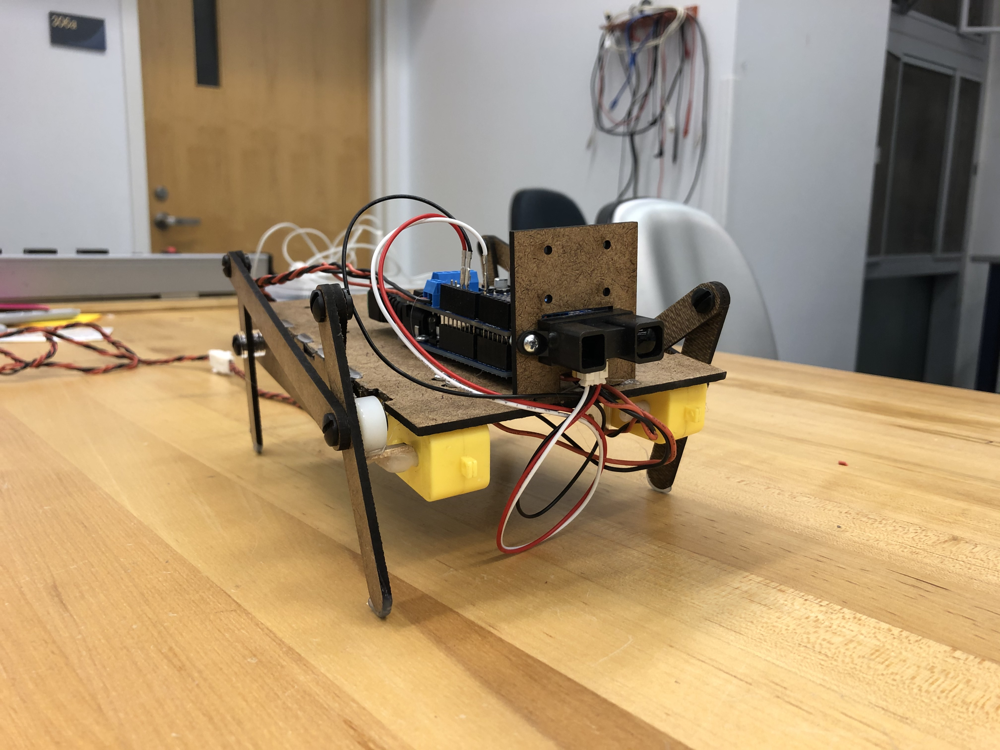
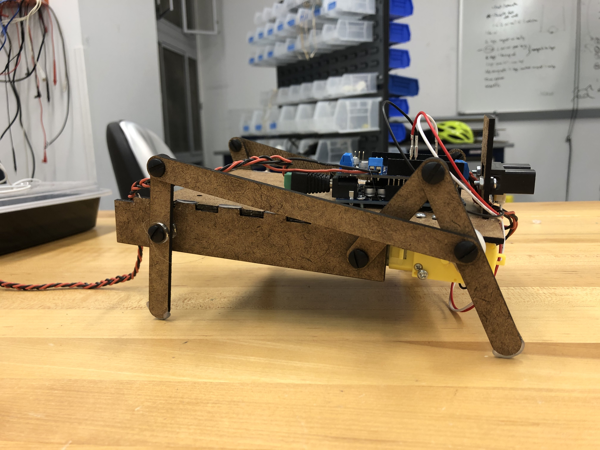

We want to develop the personality of the robot more especially with mechanical design and do a lot of user testing to make sure that the robot is "cute" and personable.

## Goals:
- Implement computer vision on the Raspberry Pi
- Use Raspberry Pi to communicate with Arduino
- Improve walking mechanism
- Develop robot appearance/personality especially making it "cute"

## Progress:
- Moves with improved linkage leg mechanism
- Can identify people with the Raspi camera
- Has fluffy "pink monster" appearance people found cute
- The walking mechanism has a wobble aspect which adds a cute personality factor
- Arduino LED lights up when Raspi sees a person (10 sec)

<!--more-->

## Mechanical

- Have a functional leg mechanism
    - iterations: foot shape, 3D print, longer legs
    - [https://grabcad.com/library/walking-robot-mechanism-1](https://grabcad.com/library/walking-robot-mechanism-1) Decided on 4 leg linkage design based on this

## Software

- Finalize sensors we want and goals
- Raspberry Pi-Arduino integration

## Design

- Research into types of walk cycles: peppy, confident, meandering, off-balance. We liked the back and forth movement that the linkage produced
- Mock up type of skins. People loved the pink fluff monster skin
    - Furry monster like (pink fluff)
    - Furry animal like (cow print fuzzy)
    - Technical look (see through panel acrylic)
- Discussed type of shape
    - Give it a butt, stuffed look
    - Make it rounder- skin sags in the middle