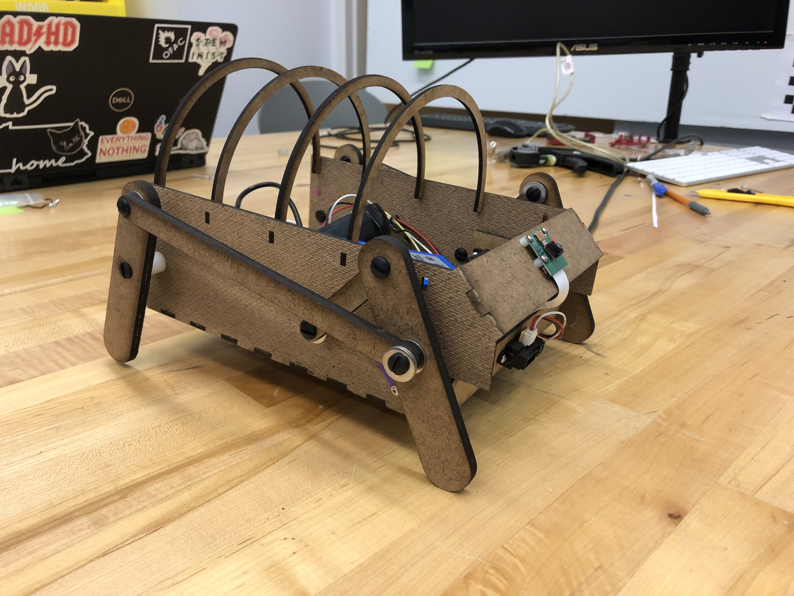
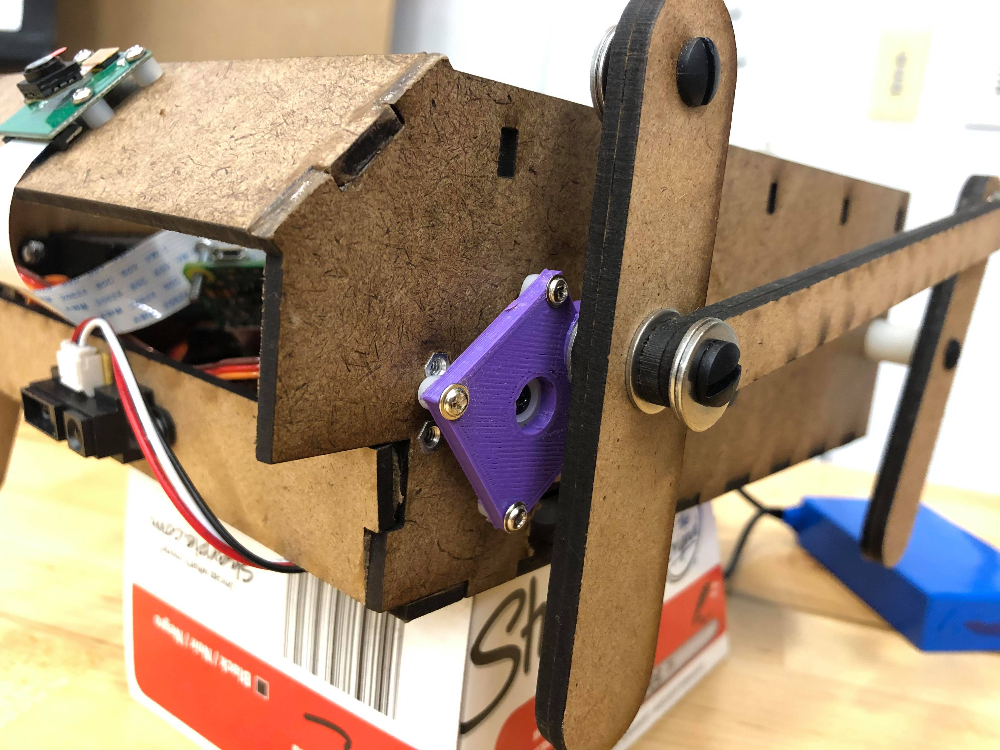

## Goals

- Integrate mechanical electrical and software systems
- Scale up to final size
- Increase mechanical robustness (no hot glue!)
- Run on battery power

## Progress:
- Attached new motor servos
- Added battery and convert its power for other components
- Arduino and Raspi wired to each other on chassis and communicate back and forth, with Arduino controlling movement and the Raspi monitoring computer vision and using the speaker
- Stronger larger design that is wood glued, not hot glued
- Added ribs on chassis over electronics to give round shape to body and fur

<!--more-->

## Mechanical

- Improve walking, by making legs thicker, making a CAD assembly, 3D printing crank part (so its a stronger and spaced right)

## Electrical

- Move to battery power
- Wiring to connect Raspi, Arduino, battery, and components

## Software

- Add sounds, and change in movement to program interactive behavior
- Add lines of code to .bashrc Raspi file, so that the Raspi runs the computer vision/main code from start-up
- Connect Raspi GPIO pins to Arduino to communicate the "stop" signal when Raspi sees a person and is talking. Arduino should stop moving.

- Get speaker working and saying one sound (a roar) when it sees a person

## Design

- Iterate on appearance, creating round hardboard ribs to put fur over parts, putting on fur, putting on eyes, making it more chunky (more towards square wall-e and round ideas)