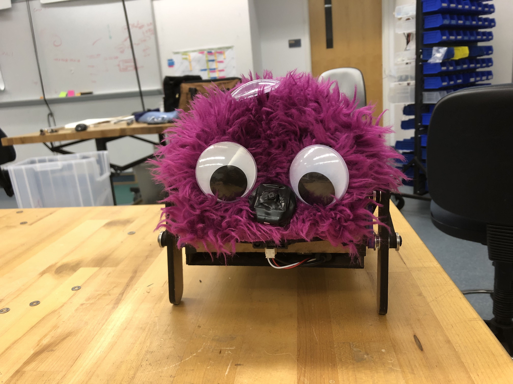
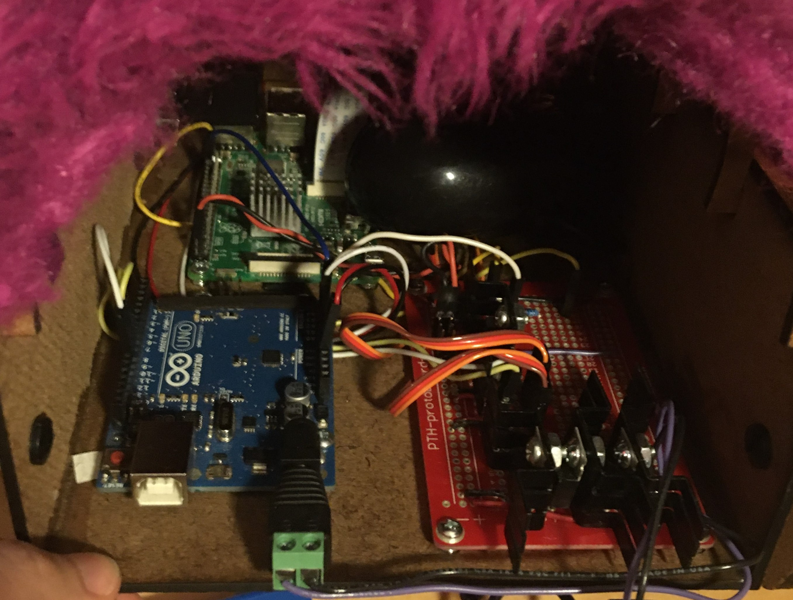
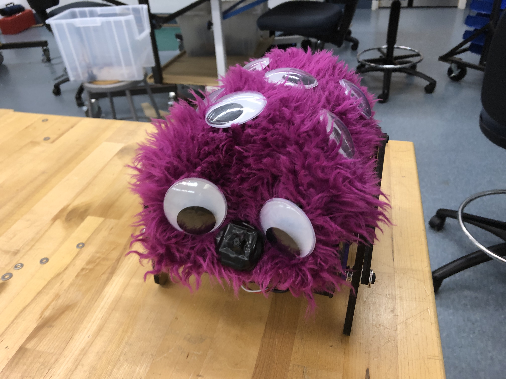

## Goals:

- Add low battery notification (over speaker)
- Redesign chassis to organize electronics for better access
- Make shape rounder
- Documentation
- Modify sounds to be more cute

## Progress:

- Added low battery notification sound by having the Arduino sense voltage from Battery, output digital high or low, convert that voltage to 3.3V range for Raspi, and have Raspi output battery low sound
- Added more small ribs to structure give a gradual rounding shape
- Redesigned chassis and had threaded inserts for parts so they held better
- Decided against modified sounds because we liked the attitude of them (very attention getting)
- Finished up Documentation
<!--more-->
## Mechanical

- Redesign chassis so that components are easier to access
- Chassis has round, semi-circle design, with ribs in the front instead of hardboard to add a round face
- Create a hardboard protrusion with a circle to come out of the fur as a fake "nose" that has the camera

## Electrical

- Create a voltage divider with a factor of 4.54 to scale down 5V output of Arduino low battery signal to 3.3V for the Raspi
- Create an updated circuit schematic

## Software

- Add variables to Arduino and Raspi to handle reading and communication of battery

## Design

- Order new googly eyes and placed them to give a fun monster vibe
- Tape the nose to mask the camera and cover the hardboard so it's a simple black nose

